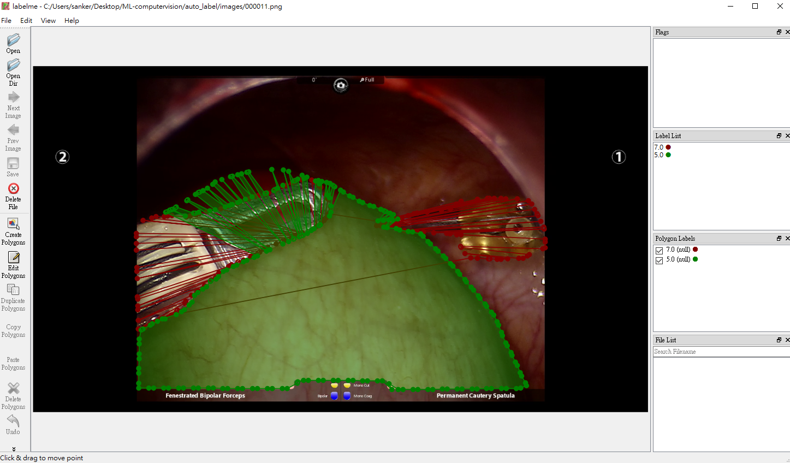

# Automatic segment fo labelme

This code is only for who need to generate new data set from sementic segmentation model

## Method

* Step1
  * Using convolutoin to find edge points from each image
    * input
    
    * visulize
    
    * output(edge_detection)
    

* Step2
    * We finding the polygen of output from model and track each center,then use tangent to find points routes

## Run
What you need to do is change file_dir

```bash
python edge_dectection.py
```

##Output in labelme

